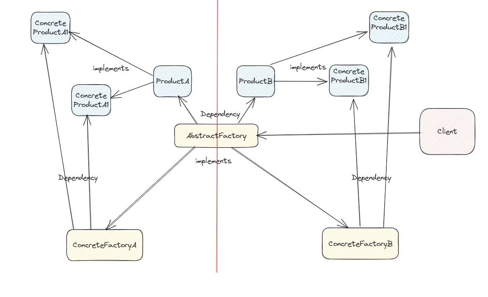

# 抽象工厂模式
抽象工厂模式（Abstract Factory Pattern）也是一种创建型设计模式，它旨在提供一种通用的接口来创建一组相关或相互依赖的对象，而无需暴露其具体实现细节。

工厂方法与抽象工厂区别：工厂方法模式只有一个抽象产品类，而抽象工厂模式有多个。
工厂方法模式的具体工厂类只能创建一个具体产品类的实例，而抽象工厂模式可以创建多个。

让我们以一个demo来说明抽象工厂模式在Java中的简单应用：

## demo

抽象工厂接口：定义了一组创建相关产品对象的方法，每个方法通常对应一个产品类

具体工厂类：实现了抽象工厂接口，负责创建具体的产品对象。

抽象产品：定义了产品对象的接口，包括产品的属性和方法。

具体产品：实现了抽象产品接口的具体类，即具体的产品对象，其特定功能和属性由具体工厂创建。

