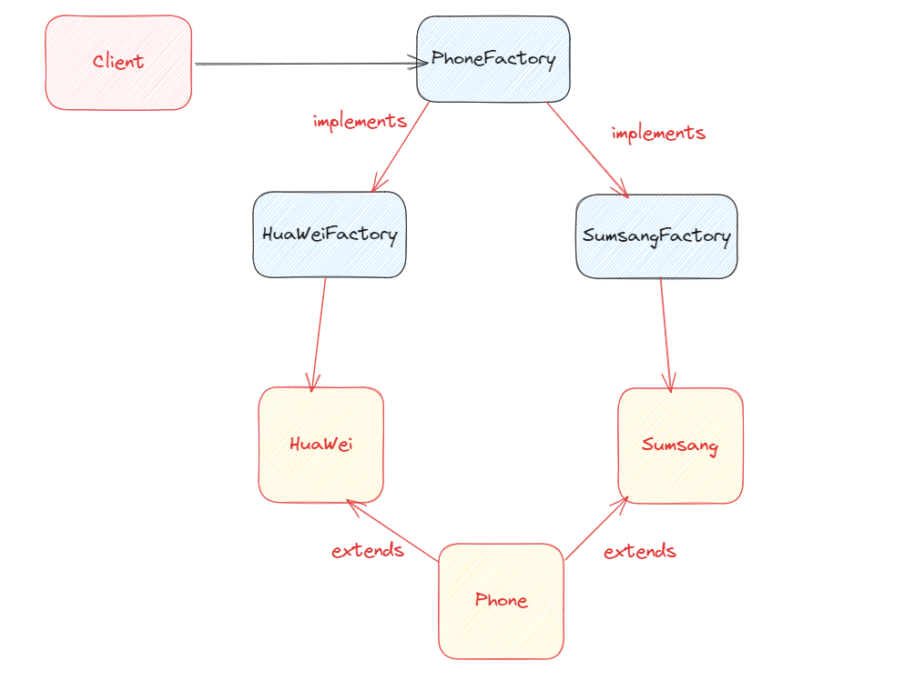

# 方法工厂模式

方法工厂模式（Factory Method Pattern）是一种创建型设计模式，它将对象的创建委托给子类，而不是在超类中直接创建对象。这样，客户端代码可以通过与超类交互，而无需了解具体子类的实现细节，从而实现了松耦合。

让我们以几个实际的例子来说明简单工厂模式在Java中的简单应用：

## demo

## phone
我们使用方法工厂模式来创建手机对象。每个具体工厂类（HuaWeiFactory 和 SamsungFactory）负责创建特定品牌的手机。
客户端代码根据需要选择具体工厂，然后使用该工厂创建手机对象。
