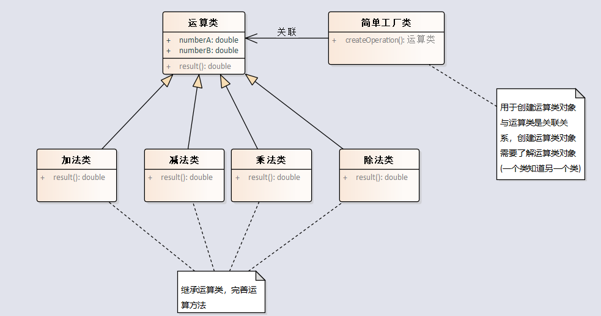

# 简单工厂模式

简单工厂模式（Simple Factory Pattern）是一种创建型设计模式，它旨在提供一种通用的接口，以便在不需揭示具体实现细节的情况下创建对象。客户端只需指定所需对象的类型，而无需关心其具体实例化过程。

简单工厂模式通过引入一个工厂类，将对象的创建过程封装起来。这个工厂类根据不同的参数或条件，实例化并返回不同的对象。

让我们以几个实际的例子来说明简单工厂模式在Java中的简单应用：

## payment

假设我们正在开发一个电子商务平台，支持多种支付方式，如支付宝、微信支付和银行卡支付。在这种情况下，我们可以应用简单工厂模式，创建一个支付工厂，根据用户选择的支付方式来生产相应的支付对象。

这种模式的好处在于，它将对象创建的复杂性隐藏在工厂内部，使客户端代码更加简洁，只需要关注所需的支付方式，而不必深入了解每个支付方式的具体构建过程。这提高了代码的可维护性和可扩展性。

## operation

客户端代码只需调用 createOperation 方法并传入运算符，无需知道每种运算对象的具体创建细节。

## operationoptimized

使用了BigDecimal优化了一下代码

