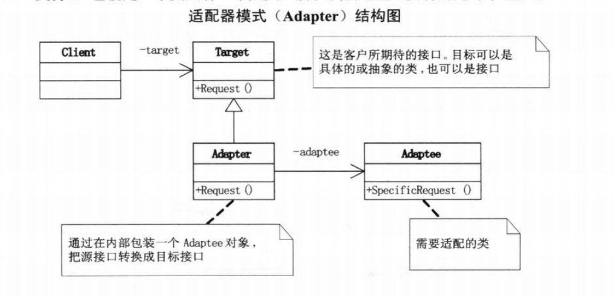

# 适配器模式

想使用一个已经存在的类，如果它的接口，也就是他的方法和你的要求不相同的时候，就应该考虑使用适配器模式
适配器模式将一个类的接口转换成客户端所期望的另一种接口。适配器模式通常用于旧代码与新系统集成、第三方库接口不兼容等场景。

公司设计以系统时考虑使用第三方开发组件，而这个组件的接口与我们自己的的系统接口是不相同的，而我们也完全没必要为了迎合它而改动自己的接口。
此时尽管是在开发的初期，我们也可以考虑使用适配器模式来解决接口不同的问题