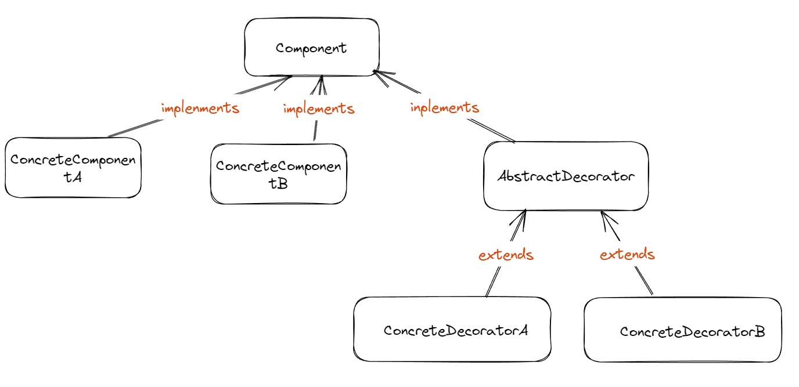
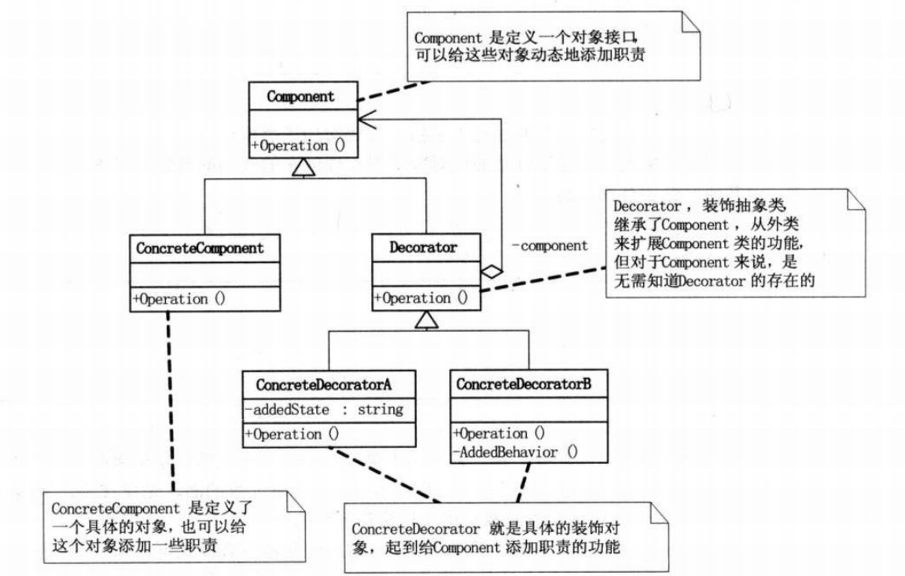
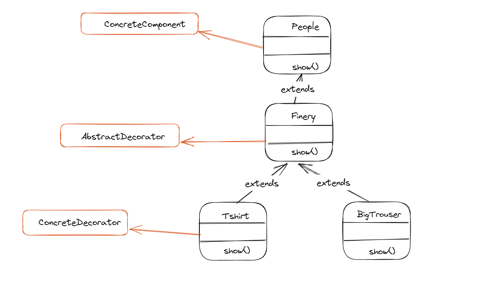

# 装饰器模式
https://www.liaoxuefeng.com/wiki/1252599548343744/1281319302594594
廖雪峰老师讲的不错！！

装饰器模式的实现过程可以概括为：
定义抽象组件接口及其具体实现类，创建装饰器基类并继承自抽象组件，通过继承装饰器基类来实现不同的具体装饰器
最终将装饰器对象链式地包裹在具体组件对象上。

如果只有一个ConcreteComponent类而没有抽象的Component类
那么Decorator类可以是ConcreteComponent的一个子类
