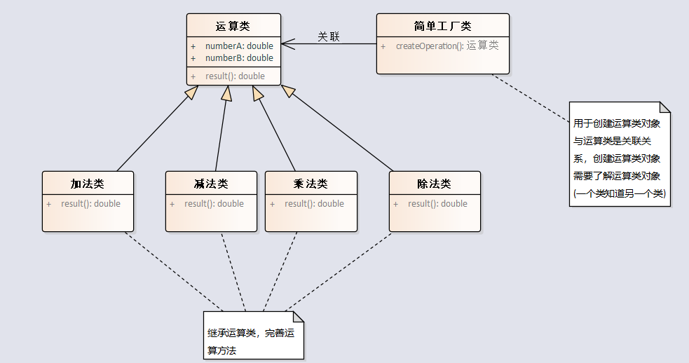

# 工厂模式

## 简单工厂模式

简单工厂模式是一种创建型模式，它提供了一种创建对象的方式，无需暴露对象的创建逻辑给客户端。
简单工厂模式通过维护一个工厂类来实现这一点，该工厂负责根据客户端请求的参数创建并返回适当类型的对象。

一句话总结：**简单工厂模式解决了创建什么对象的问题，用于创建对象实例。**

## 方法工厂模式
工厂方法模式和简单工厂模式都是创建型设计模式，它们的主要区别在于抽象工厂类的存在与否。

简单工厂模式只有一个具体工厂类，这个工厂类提供了一个静态方法或者非静态方法用于创建产品，客户端只需要通过传入参数来获得所需的产品。在简单工厂模式中，由于没有抽象工厂类，因此无法通过继承的方式进行扩展，必须修改工厂类的代码来添加新的产品，违反了开闭原则。

而工厂方法模式则将具体的工厂类抽象成为一个抽象工厂类，每个具体的产品对应一个具体的工厂类，客户端通过调用工厂类的方法来获得所需的产品。在工厂方法模式中，由于有抽象工厂类的存在，可以轻易地扩展系统以支持新的产品类型，符合开闭原则。

因此，简单工厂模式适用于产品较少且不会经常增加的场景，而工厂方法模式适用于需要支持更多产品种类并且需要经常扩展的场景。

