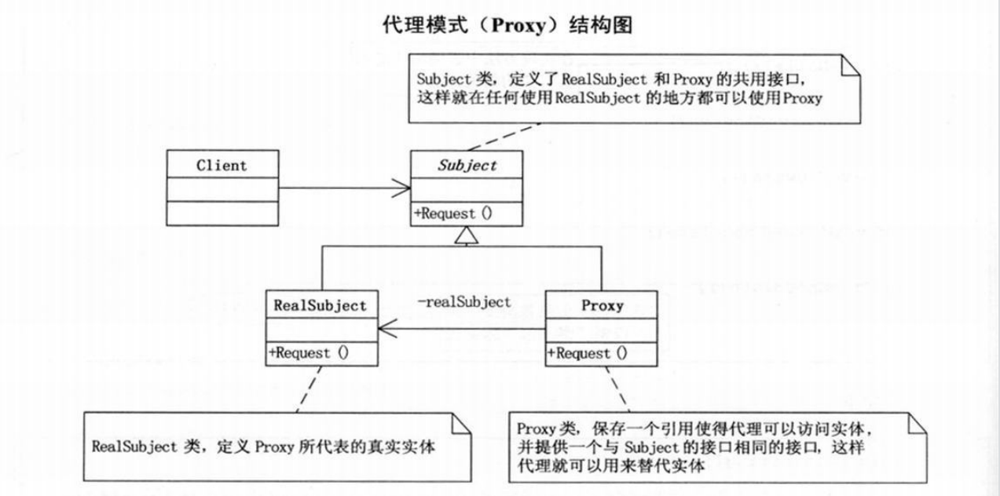

# 代理模式
代理模式是一种设计模式，它允许通过代理对象来控制对另一个对象的访问。

在代理模式中，代理对象扮演着客户端和真实对象之间的中介角色，客户端通过代理对象访问真实对象，而代理对象则可以控制、管理这个访问过程。

**代理对象通常会持有一个指向真实对象的引用，并且实现与真实对象相同的接口，这样就可以完全替代真实对象的位置。**

当客户端需要访问真实对象时，它实际上会调用代理对象的方法，然后代理对象再将请求转发给真实对象。

在转发请求之前，代理对象可以对请求进行一些预处理或者校验，以确保真实对象能够正常地处理请求。此外，代理对象还可以限制对真实对象的访问权限，从而增强系统的安全性。

代理模式有多种不同的实现方式，包括远程代理、虚拟代理、保护代理等等。其中，远程代理是指代理对象用于处理分布式系统中的远程请求，虚拟代理是指代理对象用于延迟加载大型对象，保护代理是指代理对象用于控制对敏感操作的访问权限。无论采用何种实现方式，代理模式都可以帮助我们对系统进行更灵活、更有效的管理。
